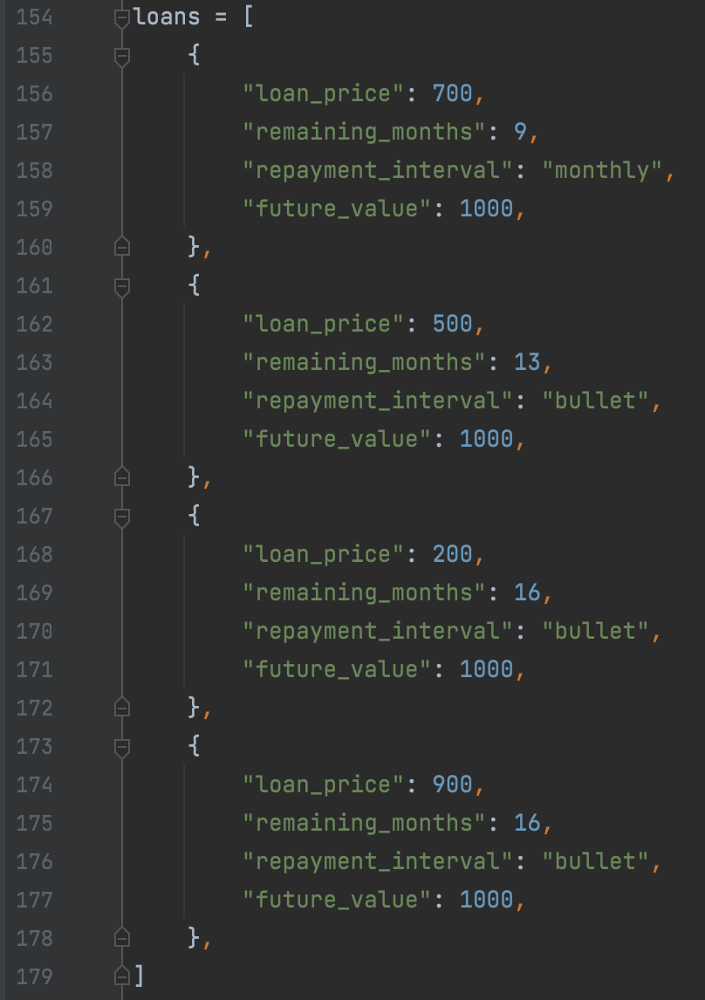
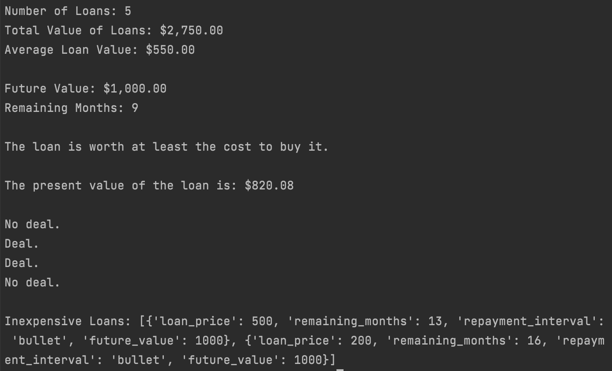

# Automated Loan Valuation

The purpose of this project is to serve as an introduction to loan analyzers with lenders showing the automation opportunity with Python. It is deliberately simple to illustrate how much can be automated with a few short and reusable lines of code, encouraging the exploration of what other more complex and time consuming processes can be automated with Python.

## Technologies

This project leverages python 3.7.

## Installation Guide

Ensure the environment in which the program is being run is python 3.7 or greater.

## Usage

To use the automated loan valuer clone the repository. In the current rudimentary state of the program the loan information is hardcoded into the **loan_analyzer.py** file beginning at line 154.  

  

Once the loans have been hardcoded, run the program by entering the following command in the terminal:  

`python loan_analyzer.py`  

Below is an example output:  

## Contributors

Josh Mischung: [josh@knoasis.io](josh@knoasis.io), [LinkedIn](https://www.linkedin.com/in/joshmischung/)

## License

MIT License

Copyright (c) [2021] [Joshua Mischung]

Permission is hereby granted, free of charge, to any person obtaining a copy
of this software and associated documentation files (the "Software"), to deal
in the Software without restriction, including without limitation the rights
to use, copy, modify, merge, publish, distribute, sublicense, and/or sell
copies of the Software, and to permit persons to whom the Software is
furnished to do so, subject to the following conditions:

The above copyright notice and this permission notice shall be included in all
copies or substantial portions of the Software.

THE SOFTWARE IS PROVIDED "AS IS", WITHOUT WARRANTY OF ANY KIND, EXPRESS OR
IMPLIED, INCLUDING BUT NOT LIMITED TO THE WARRANTIES OF MERCHANTABILITY,
FITNESS FOR A PARTICULAR PURPOSE AND NONINFRINGEMENT. IN NO EVENT SHALL THE
AUTHORS OR COPYRIGHT HOLDERS BE LIABLE FOR ANY CLAIM, DAMAGES OR OTHER
LIABILITY, WHETHER IN AN ACTION OF CONTRACT, TORT OR OTHERWISE, ARISING FROM,
OUT OF OR IN CONNECTION WITH THE SOFTWARE OR THE USE OR OTHER DEALINGS IN THE
SOFTWARE.
